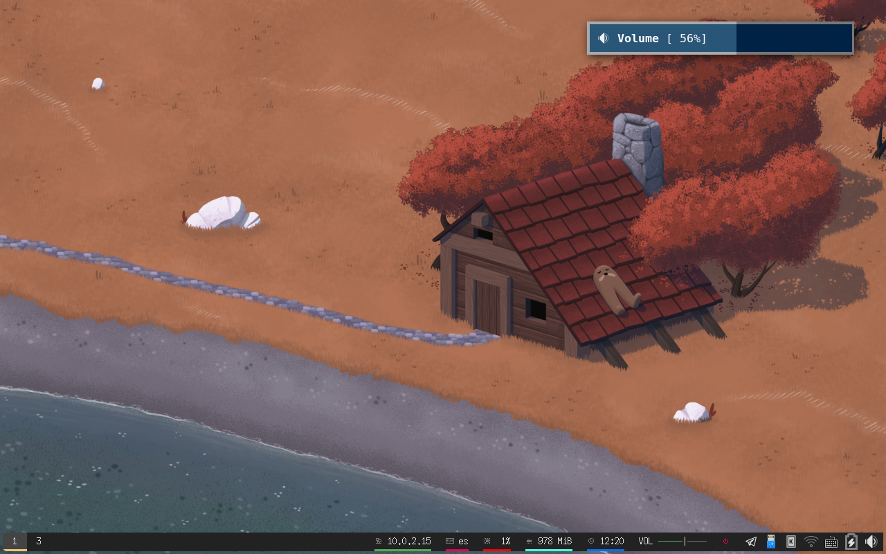
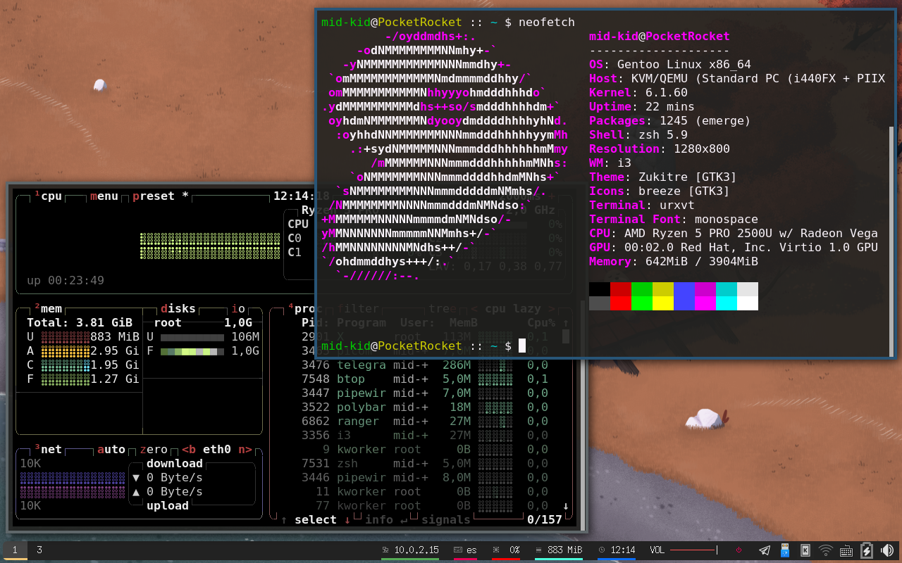
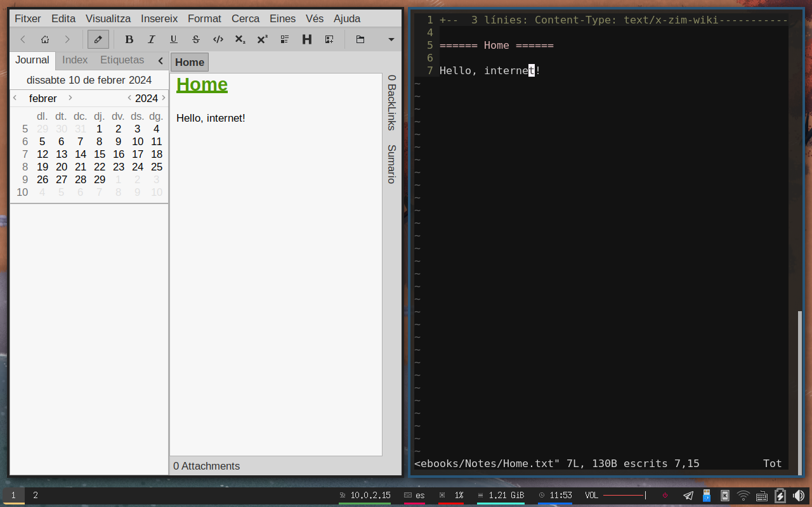
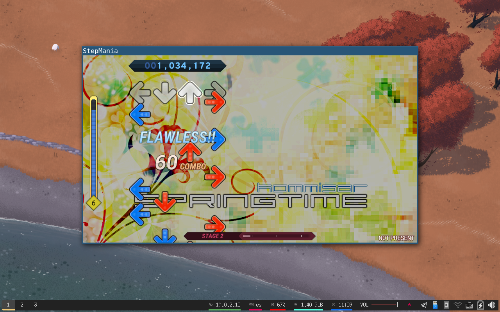
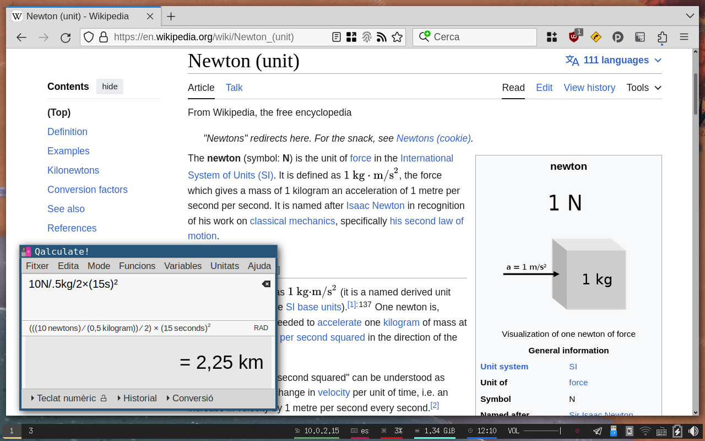

RocketISO 2024
==============

RocketISO 2024 is a live distribution based on my current main system and
configuration. It serves as a sort of bootable equivalent of a "desktop
screenshot", and a time capsule to look back on. Included in the image are a
whole range of preconfigured applications, ranging from productivity tools to
games, that I think are awesome or worth checking out. In essence, everything
that is installed on my real system is included. The current desktop is based
on Xorg and i3, with some heavy-handed patching to fix a lot of small things
that concern this specific setup.

[**Skip to the Documentation/Downloads section below**](#Documentation)

Release notes
-------------

First release, not sure what to say. This document is a ramble. More organized
words can be found in the built-in Readme, or in the documentation section
below.

It took me some two months to put this together, during which I've diligently
not updated my system, to avoid having to deal with a moving target. The part
that took the most time was making it such that I can repeat this same process
next year, and get a similar result. Unfortunately, this project cut into some
of my other activities, as I perceived that I had to finish this ASAP so I
could update my system and keep it running. At some point my rational brain
took over in a panic and started prioritizing the important things again, and
so far my computer hasn't exploded. Honestly, not worrying about updates does
free up some much-needed headspace at times. I almost feel like I'm back on
Slackware.

Part of what got me to make this right now is my plan to full-time move to
wayland/sway in the (semi-near) future. I find the ideas behind it very cool,
but thus far every attempt of mine to switch has been met with frustration that
there's just no way to use generic solutions for common problems. My biggest
pain point is power management (lid actions, battery actions, brightness
control, display blanking settings), where instead of using a common program
like xfce4-power-manager, you have to roll your own *everything*. Don't get me
wrong, I enjoy that, but my current power management setup on Xorg took years
to get *just right*, and I'm not sure I'll be able to have anything sane for a
laptop without writing a program of similar scope... Heck, I just realized my
power menu (reboot/shutdown) calls upon this daemon as its first attempt, to
let it handle the underlying complexity of upower/polkit/consolekit/logind/etc
that keeps changing every so often. I guess all the cool kids just run loginctl
directly these days, though.

Can we talk about how versatile Gentoo is? I feel that gets swept under the rug
a lot. I've been following the discourse surrounding the freshening-up of
binary packages, which in my opinion is the best thing to happen to Gentoo
since the introduction of the distribution kernels. People treat it like it's
some crazy thing, a mistimed april fools' joke, when in reality it's completely
in character for the distribution. Gentoo, at least to me, is a framework from
which to build and customize a system. It has good defaults, but when you need
to, allows you to tweak any aspect of the system, by modifying any step in its
creation. Building from source in this sense has always been a tool to achieve
this, not a necessity. A hybrid, binary-source package manager is a great way
to do things in my opinion, portage has always been this. And, as it turns out,
other distributions have started to pick up on this, like Nix and Guix, both of
which are hybrid package managers as well. It always saddens me when people
dismiss Gentoo as "that one *hardcore* distro for people who like building from
source all day, why would a *normal* person ever do that?". Given how it makes
my life significantly easier and gets out of my way, I don't think it could be
any further from the truth.

Some configuration files and repositories in the ISO may be newer than the
Gentoo tree. My computer is a living document, and even if I "freeze" the
updates, every once in a bit I find something that irks me and I change it.
Case in point, I recently improved my Vim startup performance by disabling a
plugin by default that thinks it's a great idea to run `find` on the entirety
of /usr/lib* on startup.

Technical details
-----------------

* Based on ::gentoo tree with timestamp `Thu 30 Nov 2023 10:40:01 PM UTC` (metadata/timestamp.x)
* Tested on laptop, VirtualBox, and libvirt/virt-manager.

Screenshots
-----------

Documentation
-------------

* [On-line version of the builtin readme](https://htmlpreview.github.io/?https://raw.githubusercontent.com/mid-kid/RocketISO/master/docs/README-2024.html)
* [Hints: Interesting things to do](HINTS-2024.md)
* [Errata: Known bugs/mistakes and fixes](ERRATA-2024.md)

The user account has no password. Simply press enter to log in.

Downloads
---------

The files are all being hosted courtesy of archive.org: [Details page](https://archive.org/details/rocketiso-amd64-2024).

Torrent: [rocketiso-amd64-2024\_archive.torrent](https://archive.org/download/rocketiso-amd64-2024/rocketiso-amd64-2024_archive.torrent)

Individual files (HTTP):

* [Bootable ISO](https://archive.org/download/rocketiso-amd64-2024/RocketISO-amd64-2024.iso)
* [gencfg.diff](https://archive.org/download/rocketiso-amd64-2024/RocketISO-amd64-2024-gencfg.diff): A unified diff of the `/etc` directory, to help document the configuration.
* [gencfg.log](https://archive.org/download/rocketiso-amd64-2024/RocketISO-amd64-2024-gencfg.log): The log output for the `gencfg` step of building the image, to help document the configuration.
* [repos.squashfs](https://archive.org/download/rocketiso-amd64-2024/RocketISO-amd64-2024-repos.squashfs): The ebuild repositories used to build the image.
* [distfiles.squashfs](https://archive.org/download/rocketiso-amd64-2024/RocketISO-amd64-2024-distfiles.squashfs): All the source code of the distribution.
* [packages.squashfs](https://archive.org/download/rocketiso-amd64-2024/RocketISO-amd64-2024-packages.squashfs): Portage binpkgs for all the software used to build the image, including (circular) build dependencies which aren't included with the ISO.
* [buildlogs.squashfs](https://archive.org/download/rocketiso-amd64-2024/RocketISO-amd64-2024-buildlogs.squashfs): Build logs generated during the `genrebuild` step of building the image, to aid debugging.
* [data.squashfs](https://archive.org/download/rocketiso-amd64-2024/RocketISO-amd64-2024-data.squashfs): The `data/` directory used during the build, required to rebuild the image.
