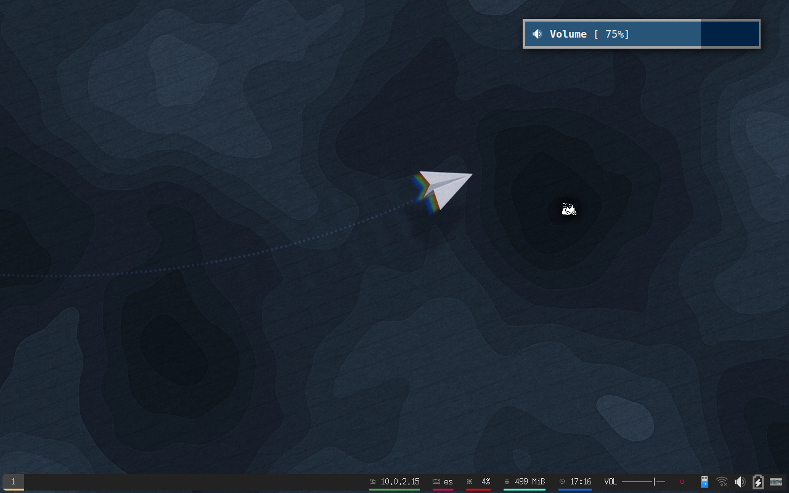
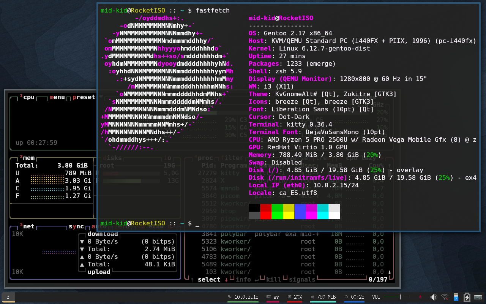
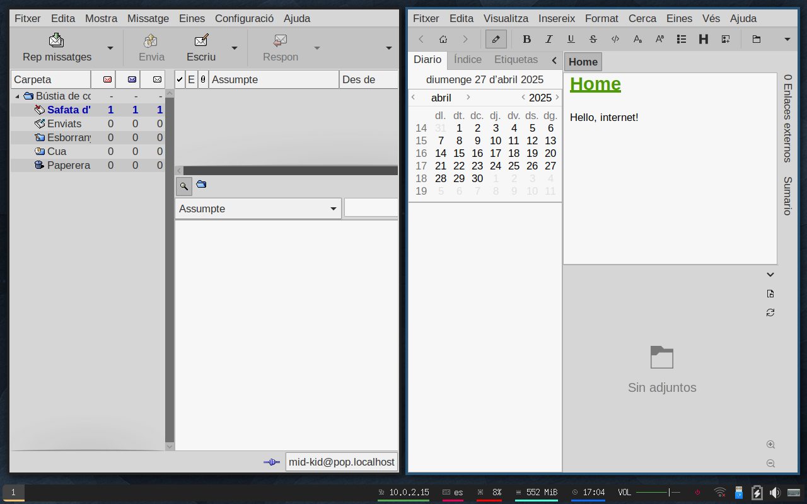
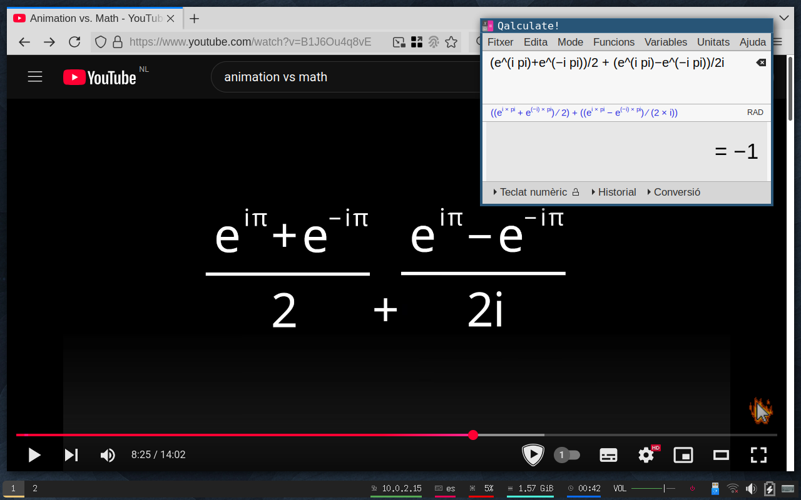
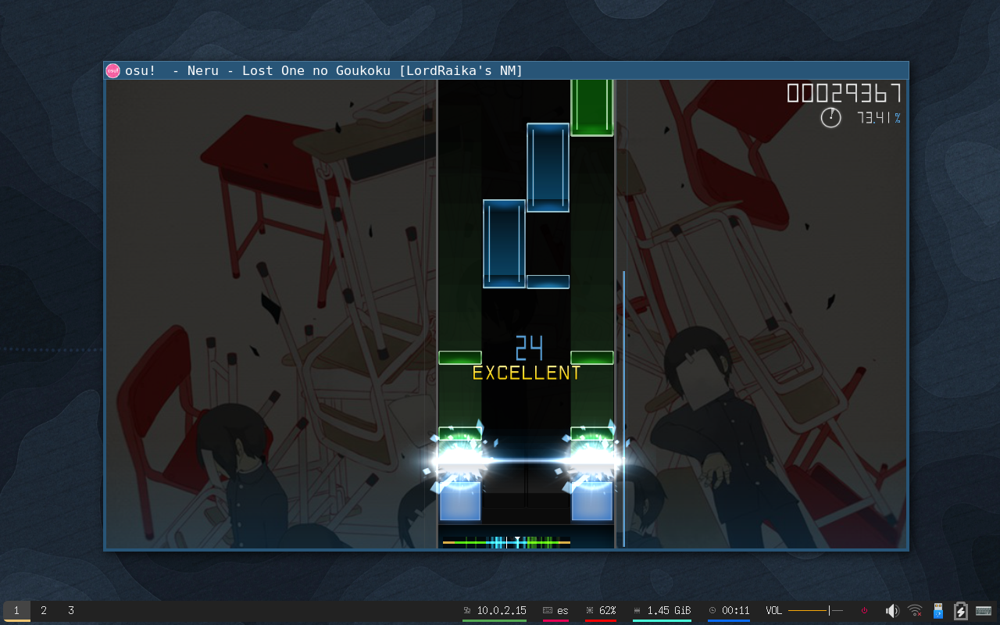
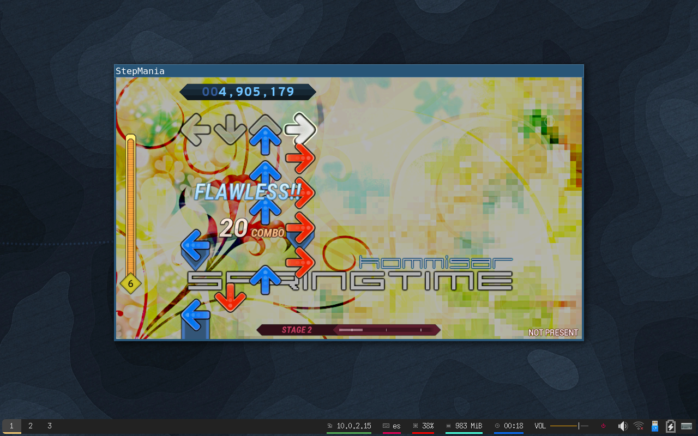

RocketISO 2025: Around the world
================================

RocketISO is a live distribution based on my current main system and
configuration. It serves as a sort of bootable equivalent of a "desktop
screenshot", and a time capsule to look back on. Included in the image are a
whole range of preconfigured applications, ranging from productivity tools to
games, that I think are awesome or worth checking out. In essence, everything
that is installed on my real system is included. The current desktop is based
on Xorg and i3, with some heavy-handed patching to fix a lot of small things
that concern this specific setup.

Are you ready to fly along?

[**Skip to the Documentation/Downloads section below**](#Documentation)

Release notes
-------------

Second year, second release. Most effort has gone into polishing all the tiny
bugs and things that break during the year, but I never have time to fix. This
is probably why it took me 4 months to finalize, and ship Gentoo software from
december 2024. Some ecosystem shifts happened, such as the move from Qt5 to
Qt6, and I haven't gotten around to migrating to wayland, yet. Maybe I can
switch to a sway/wayland session next year? Fingers crossed.

This year I bootstrapped the system from scratch, using the [live-bootstrap
project](https://github.com/fosslinux/live-bootstrap) and a [set of
notes](https://mid-kid.root.sx/git/mid-kid/bootstrap/src/branch/master/gentoo-2025/gentoo.txt)
on building gentoo from there that I've created. This means that everything,
including Go and Rust, has been compiled without involving bootstrap binaries,
and except for the kernel and hardware I was building it with, should be
relatively safe from the [Ken Thompson
attack](https://archive.org/details/reflections-on-trusting-trust). I admit,
this adds nothing to the release, but the process tickles my brain just right.
I just think it's neat that we can do this now.

In an effort to migrate to wayland in the future, the Kitty terminal was added
and configured. Out of the different terminals, I feel this one is the closest
in spirit to what I was used to from urxvt: extensible and compatible. It has a
few behaviors I don't like, that didn't match what I'm used to from different
terminals, particularly around text coloration, but I've created [patches for
those](https://github.com/mid-kid/gentoo-config/tree/d11473c148468914c24c1ce3eab88060ffd795cc/patches/x11-terms/kitty).
I'm still irked by the lack of subpixel hinting, which the dev [considers too
difficult to be worth the
effort](https://github.com/kovidgoyal/kitty/issues/214). If I don't get used to
it, I might shop around some more...

Some more tools have been added/changed. 

* HTTrack is a website archiver I only rarely use, but is essentially the best at what it does.
* Tailscale has become an instant favorite to me, as it allows me to painlessly access my devices from anywhere without worrying about where they currently are, and host things from them. Braindead simple to set up, absolute gamechanger.
* NTPd was replaced with chrony, I don't know why, but every distribution seems to have shifted to it instantly, so so did I.
* [tio](https://github.com/tio/tio) was added as a more ergonomic alternative to `minicom`, although i keep both around.
* Audacity was withheld from this release. I had pinned it to version 2.4.2 on my machine and didn't realize it was removed from the repositories already. Need to figure out what to do with it.
* Avahi/zeroconf support was added, but disabled by default. I have a script that enables the service on some networks, but that's not included in the ISO for privacy reasons.
* qpwgraph is probably the killer feature of pipewire, and as such is now included.

As a result of cutting out qt5 and wayland in this release, I left out a few
less essential applications that I don't regularly use, but still tend to keep
around. An incomplete list: Freecad, Krita, SqliteBrowser, mgba-qt, KDE
Connect, tokodon and neochat. These may be included in the next release.

Some cool things were added this year, most of my effort has gone to adding
some of my favourite "Osu!" songs (which inevitably leads to me "playtesting"
for hours), and Minecraft was added since I've started playing that again. I
intend to add more games and emulators with future releases, as I think it's a
neat way of archival.

--------------------------------------------------------------------------------

From here, some personal blogging/rambling.

[**Skip to the Documentation/Downloads section below**](#Documentation)

"Around the world", I'm not sure why I chose this wallpaper. I'm gliding along,
but I don't think I'm heading anywhere. Taking 4 (almost 5 at this point)
months to release something for which 90% of the work was already finished
never feels too great. Problem is, this isn't the only thing that's constantly
being delayed. Everything is taking forever, and while I can see that I'm
probably doing too much, I don't want to give up on the hobbies I still enjoy.

I've recently bought one of them "emulation handhelds". They're little portable
linux machines, with nice controller inputs. This has shortly reawakened the
fun in video games for me, as it's very easy to pick up and put down, and
syncthing for installing games onto it without going through a song and
dance... It's wonderful, really. The killer feature of these is something
called "PortMaster", a repository of linux games that work, or have been
adapted to work on arm64. I wasn't aware of just how many modern open source
Linux games there are! I know Debian and other distributions have a large
collection of such games, but anything past maybe 2010 doesn't get published
through package repositories, and is harder to discover. I wonder if I can use
gentoo/portage to make them easier to port? That'd be cool I think.

Big things are happening in Gentoo this year again. I haven't updated yet, but
I know that Rust is properly bootstrappable now using mrustc, and I'm hearing
murmurs about properly packaging that ecosystem. On my side, I might end up
making my first few contributions to Portage soon? I hope that works out
alright.

Technical details
-----------------

* Based on ::gentoo tree with timestamp `Wed 01 Jan 2025 10:40:00 PM UTC` (metadata/timestamp.x)
* Tested on laptop, VirtualBox, and libvirt/virt-manager.

Screenshots
-----------

Documentation
-------------

* [On-line version of the builtin readme](https://htmlpreview.github.io/?https://raw.githubusercontent.com/mid-kid/RocketISO/master/docs/README-2025.html)
* [Hints: Interesting things to do](HINTS-2025.md)
* [Errata: Known bugs/mistakes and fixes](ERRATA-2025.md)

The user account has no password. Simply press enter to log in.

Downloads
---------

The files are all being hosted courtesy of archive.org: [Details page](https://archive.org/details/RocketISO-amd64-2025_1).

Torrent: [RocketISO-amd64-2025\_1\_archive.torrent](https://archive.org/download/RocketISO-amd64-2025_1/RocketISO-amd64-2025_1_archive.torrent)

Individual files (HTTP):

* [**Bootable ISO**](https://archive.org/download/RocketISO-amd64-2025_1/RocketISO-amd64-2025.iso)

* [packages.txt](https://archive.org/download/RocketISO-amd64-2025_1/RocketISO-amd64-2025-packages.txt): List of packages included in the ISO.
* [packages.squashfs](https://archive.org/download/RocketISO-amd64-2025_1/RocketISO-amd64-2025-packages.squashfs): Portage binary packages for all the software used to build the image, including build dependencies which are omitted from the ISO.
* [repos.squashfs](https://archive.org/download/RocketISO-amd64-2025_1/RocketISO-amd64-2025-repos.squashfs): The ebuild repositories used to build the image.
* [distfiles.squashfs](https://archive.org/download/RocketISO-amd64-2025_1/RocketISO-amd64-2025-distfiles.squashfs): All the source code of the distribution.
* [distfiles\_bootstrap.squashfs](https://archive.org/download/RocketISO-amd64-2025_1/RocketISO-amd64-2025-distfiles_bootstrap.squashfs): Additional source code used to bootstrap the system from scratch.
* [distfiles\_bootstrap\_removed.txt](https://archive.org/download/RocketISO-amd64-2025_1/RocketISO-amd64-2025-distfiles_bootstrap_removed.txt): Files ommitted from the `distfiles_bootstrap.squashfs` archive.
* [data.squashfs](https://archive.org/download/RocketISO-amd64-2025_1/RocketISO-amd64-2025-data.squashfs): The `data/` directory used during the build, required to rebuild the image.
* [buildlogs.squashfs](https://archive.org/download/RocketISO-amd64-2025_1/RocketISO-amd64-2025-buildlogs.squashfs): Build logs generated during the `genrebuild` stage of building the image, for debugging purposes.
* [gencfg.diff](https://archive.org/download/RocketISO-amd64-2025_1/RocketISO-amd64-2025-gencfg.diff): A unified diff of the `/etc` directory compared to gentoo defaults.
* [gencfg.log](https://archive.org/download/RocketISO-amd64-2025_1/RocketISO-amd64-2025-gencfg.log): The output for the `gencfg` step of building the image, to help document the configuration.
